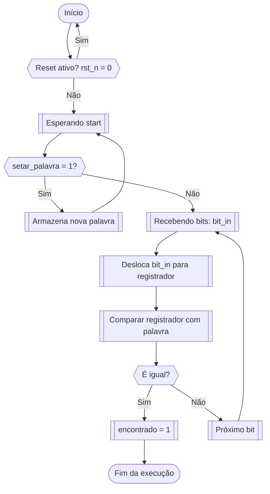

# Detecção de Sequência

Encontrar padrões é uma tarefa fundamental em computadores e circuitos digitais. Seja para identificar comandos em sinais, detectar palavras-chave em fluxos de dados ou simplesmente buscar uma determinada sequência, essa lógica está por trás de diversos sistemas.

Nesta atividade, você implementará um módulo em **Verilog** que busca uma **subsequência binária de 8 bits** dentro de uma sequência maior que chega **serializada** — ou seja, **um bit por ciclo de clock**.

---

## O que significa sequência serializada?

Imagine que você quer enviar a sequência `10101100`, mas ao invés de mandar todos os bits ao mesmo tempo, você envia **um por vez** a cada ciclo de clock. Isso é uma **entrada serial**.

Por exemplo:
```text
Clock:     ↑ ↑ ↑ ↑ ↑ ↑ ↑ ↑ ↑ ↑ ↑ ↑ ↑ ↑ ↑ ↑ ↑ ↑ ↑ ↑
bit_in:    1 1 1 0 0 1 0 1 0 0 1 1 0 0 0 0 0 0 0 0
```

Você não tem acesso direto ao vetor completo, só vai processando **bit a bit**, tentando encontrar um padrão previamente definido.

---

## Objetivo

O seu módulo deve detectar se uma **sequência de 8 bits** (chamada `A`) aparece dentro de uma **sequência serial** maior (`B`), que chega pelo sinal `bit_in`. A sequência `A` pode ser atualizada dinamicamente usando um sinal de controle.

---

### Exemplo

```verilog
A = 8'b01001100;
B = 20'b11100101001001100000; // entrada bit a bit no sinal bit_in
```

A sequência `A` está contida em `B`:
```
               ↓↓↓↓↓↓↓↓
B: ... 1 0 0 1 0 0 1 1 0 0 ...
              A = 01001100
```

Agora, se A for `8'b01001101`, essa nova `A` **não aparece** na mesma sequência B.

---

## Comportamento Esperado

Seu módulo `Sequencia` deve ter os seguintes sinais:

### Entradas:
- `clk`: clock do sistema
- `rst_n`: reset síncrono, ativo em nível lógico baixo
- `setar_palavra`: quando em nível alto, a sequência `palavra` deve ser armazenada como nova sequência a ser buscada
- `palavra`: sequência de 8 bits que será buscada
- `start`: indica que a sequência B está começando a chegar (bit a bit em `bit_in`)
- `bit_in`: bit de entrada serial (um bit por ciclo de clock)

### Saída:
- `encontrado`: vai para nível alto (1) quando a sequência `palavra` for detectada na sequência serial `bit_in`. Após encontrar, o módulo pode parar de analisar.

---

### Fluxo geral do módulo

1. Quando `setar_palavra` estiver em nível lógico alto, a sequência presente em `palavra` deve ser armazenada internamente para futuras comparações.
2. Após o sinal `start`, o módulo começa a processar os bits recebidos serialmente através de `bit_in`.
3. A cada borda de subida do sinal de clock (`clk`), um novo bit é lido e inserido em um registrador de deslocamento, mantendo sempre os últimos 8 bits recebidos.
4. O conteúdo atual do registrador de 8 bits é comparado com a sequência armazenada.
5. Se os bits coincidirem exatamente, o sinal `encontrado` deve ser ativado (setado para 1), e a busca pode ser finalizada.

O comportamento descrito pode ser visualizado no fluxograma abaixo:



---

## 💻 Atividade

Implemente o módulo `Sequencia` em **Verilog**. Você pode usar o seguinte template como base:

```verilog
module Sequencia (
    input wire clk,
    input wire rst_n,

    input wire setar_palavra,
    input wire [7:0] palavra,

    input wire start,
    input wire bit_in,

    output reg encontrado
);
// Implementação aqui

endmodule
```

---

## Execução da atividade

Siga o modelo de módulo já fornecido e utilize o testbench e scripts de execução para sua verificação. Em seguida, implemente o circuito de acordo com as especificações e, se necessário, crie outros testes para verificá-lo.

Uma vez que estiver satisfeito com o seu código, execute o script de testes com `./run-all.sh`. Ele mostrará na tela `ERRO` em caso de falha ou `OK` em caso de sucesso.

## Entrega

Para submeter o projeto, basta fazer um *commit* no repositório do **GitHub Classroom**. O sistema de correção automática já está configurado para validar sua implementação e atribuir uma nota com base nos testes.  

> **Dica:**  Não modifique os arquivos de correção! Para entender como os testes funcionam, consulte o script `run.sh` disponível no repositório.
